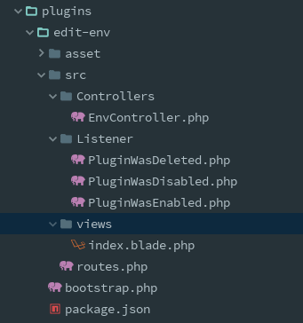
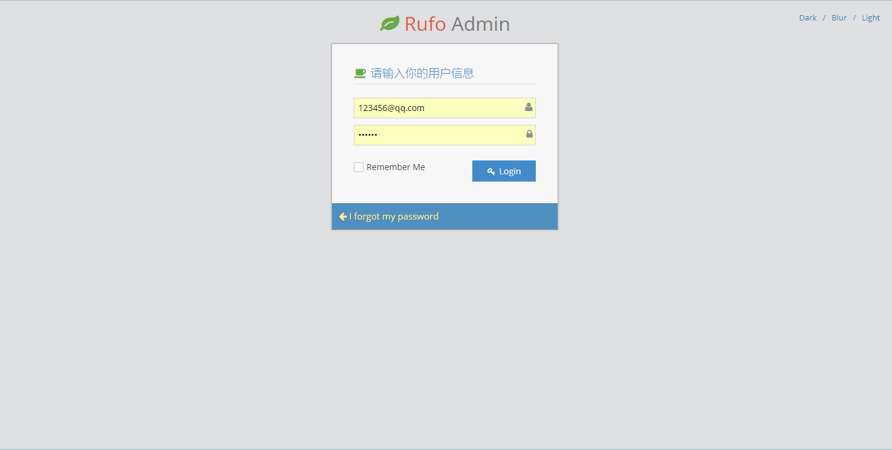
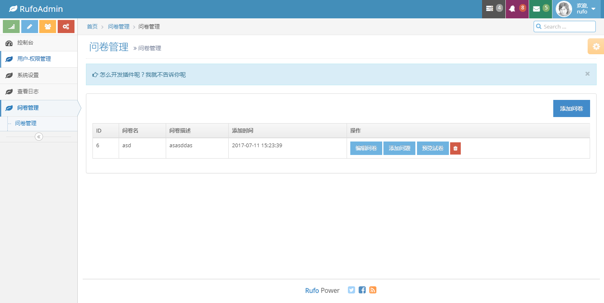
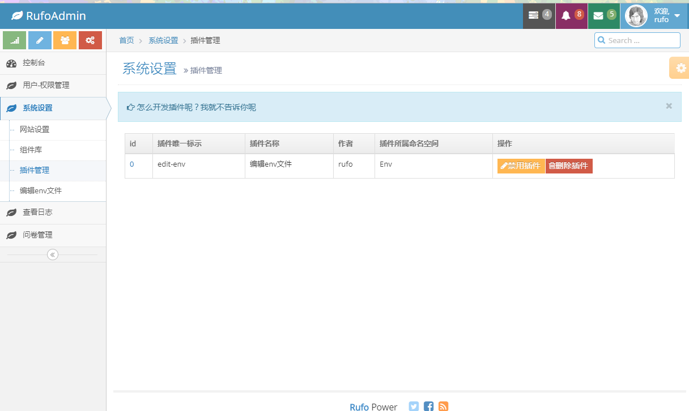
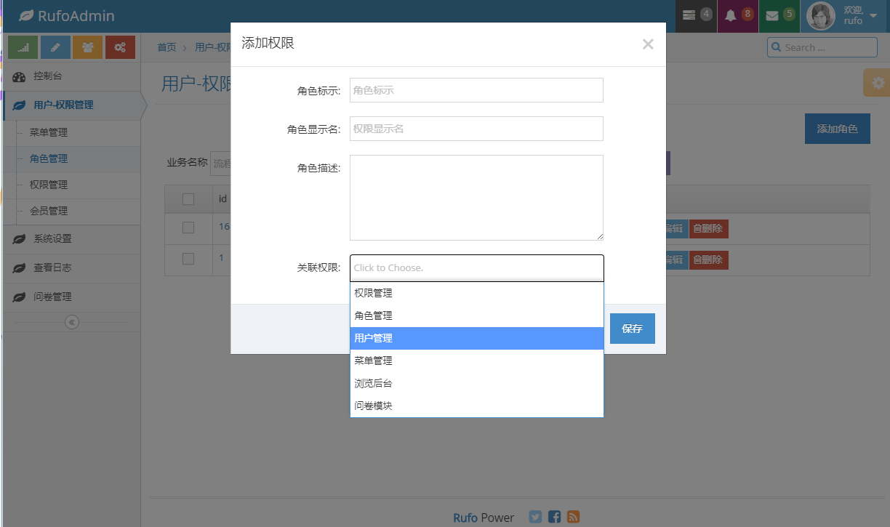

## About RufoAdmin

为什么我要做这个后台系统？我太闲？当然不是，提高生产力！这是一个基于laravel5.4的管理后台，页面采用ACEAdmin，
已经内置了RBAC权限管理，多语言问卷，日志管理等等功能，更多功能等你发现。有些细节可能没有注意，所以可能会有bug！

## How to use
- composer install
- cp .env.bak .env
- 运行rufoadmin.sql
- happy enjoy!
## 特别提醒
千万不要忘记STAR,START,STAR ! ! !
- 建议使用PHP7环境，mysql使用5.6，不开严格模式，group by在严格模式下不能兼容。
- 临时测试地址：http://www.rufo.site/admin/login
- 超管账号：123456@qq.com 密码：123456  请不要随便操作菜单
- 没什么权限的用户：123@qq.com 密码：123456  请不要随便操作菜单
## 一些特别的说明
1. 怎么实现的权限控制的呢？
```$xslt
我主要实现了角色-用户-权限的机制，如果用户没用权限这不能显示对应的菜单，并且不能访问对应的URL，
后台有一个特别的权限是浏览后台，记忆啥名忘记了。
```
2. 多语言问卷是怎么回事呢？
```$xslt
因为在以前工作中老用到问卷模块就顺手加了一个，只是实现了一个后台的功能，前台需要自己实现，内置3中语言中日英。问题类型单选，多选，问答题。
```
3. 插件机制，如何实现插件机制？
```$xslt
作者开发前期有一个愚昧的想法，把每个模块写在一个单独的包里，通过composer自动加载，但是这样扩展性依然不是很高，并且对用户友好，作者开发的
的admin后台模块就是在一个包里，基本所以代码都在一个包里，这对别人维护来说有点捉襟见肘。最终想起了wordpress的即插即用的插件机制。
如何实现插件机制呢?我前期只能模仿wordpress来开发，wordpress的钩子函数是插件的核心，而laravel却没有对应的功能，作为替代方案我觉得可以用事件来代替。
最终实现了简单的插件功能，插件开启，关闭，删除都会触发对应的插件，插件开启时其代码也会被加载！
```

## 开发一个简单的插件
特别的，我规定插件放在plugins目录，每个插件目录下面有一个package.json文件配置插件的信息。
- 目录结构如下图所示：
- 
```$xslt
注意：实际控制器的命名空间应该和package.json文件里面的命名空间相对应。当开启一个插件时会执行
PluginWasEnabled.php的代码，其他类似
```
- 逼者写了2个方法来添加和删除菜单，源码位于packages/admin/src/Admin.php
```$xslt
//add_menu($title, $url, $parent_menu_id=0,$is_create_permission = false,$permission_name='')
Admin::add_menu('编辑env文件', 'system/env/index',7);
Admin::delete_menu('编辑env文件');
```

- 对于插件中有有资源文件的情况，需要执行以下代码来拷贝资源到public目录
```$xslt
$file = new FileUtil();
$file->copyDir(plugin_address('edit-env/asset'),'vendor/plugins/edit-env',true);
- 插件的路由对应插件的routes.php，views视图文件对应插件的views目录
- 其他：略，以后补充
```


## 大概什么样子
- 
- 
- 
- 
- 

## 关于我


##后台开发说明

1. 开发流程:添加权限(权限标识和url一致，例如：admin/permission/index)->添加url->添加菜单(绑定权限)->修改逻辑.
3. 权限名字应用菜单url相同,菜单的(菜单active_url)是激活的样式

## 后期计划
1. 添加内容管理功能，例如文章管理
2. 添加用户权限组功能
3. 商城。。。
## License

rufoadmin is open-sourced software licensed under the [MIT license](http://opensource.org/licenses/MIT).
